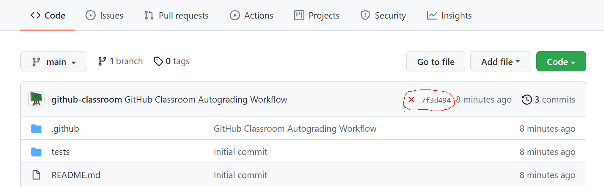

ეს ვებგვერდი თან ახლავს თავისუფალი უნივერსიტეტის კრიპტოგრაფიის
(aka კომპიუტერული სისტემების უსაფრთხოების) კურსს.
აქ იპოვით ინფორმაციას ლექციებზე, სემინარებსა და საშინაო დავალებებზე,
ასევე სხვა გამოსადეგ ბმულებს.
კურსის ფორუმად ვიყენებთ 
[Google Classroom](https://classroom.google.com/c/NzU2MDYyMTQyMDM4)-ს.

ლექტორის ელფოსტა: [g.osipovi@freeuni.edu.ge](mailto:g.osipovi@freeuni.edu.ge)

## კურსის აღწერა

კრიპტოგრაფია კომპიუტერულ სისტემებში ინფორმაციის დაცვის შეუდარებელი საშუალებაა. 
მის გარეშე წარმოუდგენელი იქნებოდა თანამედრობე ინტერნეტ ბიზნებისა და სერვისების დიდი ნაწილი.
ამ კურსში ისწავლით კრიპტოგრაფიული პრიმიტივების გამოყენებას და მათი მუშაობის ძირითად პრინციპებს.

კურსი შედგება 16 ლექციისა და 16 სემინარისგან.
შეფასება ხდება 3 საშინაო დავალების (3x10%) და ორი გამოცდის - 
შუალედურის (30%) და ფინალურის (40%) - მიხედვით.

**ლექციების** ვიდეოებს უნდა უყუროთ _დამოუკიდებლად_.
ჩანაწერებს იპოვით [ამ ვებგვერდზე](https://crypto.stanford.edu/~dabo/courses/OnlineCrypto/) ან 
[Coursera-ზე](https://www.coursera.org/learn/crypto).
(შეგიძლიათ კურსერას კურსი აიღოთ და მიყვეთ სემესტრის განმავლობაში, ბოლოს სერტიფიკატიც მოითხოვოთ).

**სემინარის** ამოცანები დევს [ამ ფოლდერში](https://drive.google.com/drive/folders/1RKYtNTA7EICkWdBVIcEVjUYeGgw288PN?usp=sharing),
ვიდეოამახსნები კი
[ამ პლეილისტში](https://www.youtube.com/playlist?list=PLsJx0uONbaNY42xlbxDiOtjofes1QWOgz).
_რჩევა:_ სანამ ამოხსნის ვიდეოს უყურებთ, სცადეთ ამოცანის ამოხსნა დამოუკიდებლად ან სხვა სტუდენტებთან ერთად.

კურსში არ გვაქვს ოფიციალური **სახელმძღვანელო**,
რომელსაც მივყვებით ტექსტთან ახლოს.
ყველა საჭირო თემაზე წერია [ბონეს და შუპის შიგნში](http://toc.cryptobook.us/),
თუმცა ის გათვლილია სამაგისტრო და სადოქტორო სტუდენტებზე.
უფრო მარტივი და დასრულებული სახელმძღვანელოა 
[კაცისა და ლინდელის წიგნი](http://www.cs.umd.edu/~jkatz/imc.html).

### დავალებები

საშინაო დავალებებისთვის ვიყენებთ GitHub Classroom-ს.
დავალებებს ვწერთ Python 3-ზე. 
შეგიძლიათ გამოიყენოთ მხოლოდ [სტანდარტული ბიბლიოთეკის](https://docs.python.org/3/library/) ფუნქციები.

- პირველი დავალების ბმული: <https://classroom.github.com/a/biFUVLBZ>
- მეორე დავალების ბმული: <https://classroom.github.com/a/X5m8A3Rl>
- მესამე დავალების ბმული: <https://classroom.github.com/a/AzmJAX8P>

ყველა დავალების **დედლაინი** არის ფინალურ გამოცდამდე **ორი კვირით** ადრე. 

ბმულზე გადასვლის შემდეგ GitHub შეგიქმნით რეპოზიტორიას, რომელშიც იქნება საწყისი ფაილები, 
დავალების ინსტრუქცია და ტესტები თქვენი კოდის შესამოწმებლად. 
როდესაც კოდს თქვენს კომპიუტერში აამუშავებთ და მოცემულ ტესტებზე გაატარებთ, 
გააკეთეთ commit. ყოველ კომიტზე ავტომატურად გაიშვება ავტოგრეიდერი, 
რომელიც კოდს ტესტებზე შეამოწმებს. ავტოგრეიდინგის შედეგი გამოიყურება ასე:

დეტალების სანახავად ორი გზა გაქვთ:

1. დააჭირეთ სიმბოლოს (სქრონშოტზე, წითელ X-ს მონიშნულ არეში) და შემდეგ Details.
2. გადადით Actions-ში, აირჩიეთ GitHub Classroom Autograding Workflow, და შედმეგ Autograding.

საბოლოო შემოწმება, რომლის მიხედვითაც დაიწერება ქულები, მოხდება დახურულ ტესტებზე, რომელსაც ავტვირთავთ დედლაინის მერე.

  ყველა ფაილი ავტომატურად მოწმდება **პლაგიატზე**. 
  ეჭვის შემთხვევაში კოდს პლაგიატზე აფასებს შოთა :smiling_imp:

## განრიგი

ეს არის სავარაუდო განრიგი. 
ვიდეოების სახელები იგივეა რაც [ამ გვერდზე](https://crypto.stanford.edu/~dabo/courses/OnlineCrypto/).
თუ გინდათ, მოძებნოთ შესაბამისი თავი წიგნში, შეგიძლიათ გამოიყენოთ [CS255-ის სილაბუსი](http://crypto.stanford.edu/~dabo/cs255/syllabus.html).

|    | ლექციაზე განვიხილავთ                      | შემდეგი კვირისთვის საყურებელი ვიდეო                              | შემდეგი კვირის ამოცანები     |
| -- | ----------------------------------------- | ---------------------------------------------------------------- | ---------------------------- |
| 0  |                                           | What is cryptography?; Crash course in discrete probability      | Discrete Probability         |
| 1  | შესავალი                                  | Stream Ciphers 1, 2, 3                                           | Problem Set 1: 1, 2, 3       |
| 2  | One-Time Pad, Stream ciphers              | Stream Ciphers 4                                                 | Problem Set 1: 4, 5, 6       |
| 3  | Pseudorandom generators, Sematic security | Block Ciphers 1, 2, 3                                            | Problem Set 2: 1, 2          |
| 4  | DES, AES, Pseudorandom permutations       | How to Use Block Ciphers 1, 2                                    | Problem Set 2: 3, 4, 5, 6, 7 |
| 5  | Block ciphers, modes of encryption        | Message Integrity 1, 2                                           | Problem Set 3: 1, 2, 3       |
| 6  | Message authentication codes (MAC)        | Collision Resistance 1, 2; HMAC                                  | Problem Set 3: 4, 5, 6, 7, 8 |
| 7  | Hash functions, HMAC                      | Authenticated Encryption 1, 2, 3                                 | შარშანდელი შუალედურის ბილეთი |
| 8  | Chosen ciphertext attacks                 | Odds and Ends 1, 2, 3                                            | Problem Set 4: 1, 2, 3       |
| 9  | Authenticated encryption                  | Number Theory 1, 2                                               | Problem Set 5: 1             |
| 10 | დასვენება                                 |                                                                  |                              |
| 11 | Number theory and groups                  | Basic Key Exchange 1, 2                                          | Problem Set 5: 2, 3          |
| 12 | Key exchange, Diffie-Hellman              | PKE from Trapdoor Permutations, PKE From Diffie-Hellman: ElGamal | Problem Set 6: 1             |
| 13 | Chosen ciphertext security, ElGamal       | PKE from Trapdoor Permutations: RSA, attacks                     | Problem Set 6: 2, 3          |
| 14 | RSA                                       |                                                                  | შარშანდელი ფინალურის ბილეთი  |
| 15 |                                           |                                                                  |                              |
| 16 |                                           |                                                                  |                              |

## კონსპექტები

- [იდეალური დაცულობა და შენონის თეორემა](https://hackmd.io/@gosip/perfect-secrecy)
- ...
- [ჯგუფები და დიფი-ჰელმანის გასაღების გაცვლის პროტოკოლი](https://hackmd.io/@gosip/groups-diffie-hellman)
- [მოდულარული არითმეტიკა](https://hackmd.io/@gosip/mod-arithmetic)
- [დაშიფრვა საჯარო გასაღებით და RSA](https://hackmd.io/@gosip/pke-and-rsa)

### დამატებითი სავარჯიშოები

ეს ამოცანები შეგიძლიათ გამოიყენოთ დამატებით სავარჯიშოებად.
ცნობისთვის, შუალედურისა და ფინალური ამოცანები იქნება სხვა სტილისა და სირთულის, უფრო Problem Set-ების მსგავსი.
თუ ამოხსნები დაგაინტერესებთ, შეგვიძლია განვიხილოთ სემინარზე ან/და საკონსულტაციო საათების დროს.

წყაროები:
- R - როსულეკის უფასო წიგნიდან ["The Joy of Cryptography"](https://joyofcryptography.com/pdf/book.pdf)
- KL - კაცის და ლინდელის წიგნი (დევს კლასრუმზე)

| თემა                               | R                     | KL                     |
| ---------------------------------- | --------------------- | ---------------------- |
| One-Time Pad                       | 1.(1,2,4,5,7,8,10)    | 2.(8,9,10).            | 
| Pseudorandom Generators            | 5.(1,7-14)            | 3.(5,6)                |
| Pseudorandom Functions             | 6.(2-10,17), 8.12     | 3.(11,14,15,16,19)     |
| Block Ciphers                      | 8.(4,6,8,13bc,14,15)  | 3.(26,29-33)           |
| MACs                               | 10.(1,2,5)            | 4.(5,6,7,13-16,19,20)  |
| Hash Functions                     | 11.(2,7,13)           |                        |
| Number Theory, Diffie-Hellman, RSA | 14.(1,3,5,8)          | 9.(4-6,10-13,21,28,29) |

## სხვა ბმულები

### წიგნები და კონსპექტები

- ბონეს და შუპის წიგნი: <http://toc.cryptobook.us/>
- როსულეკის წიგნი: <https://joyofcryptography.com/pdf/book.pdf>
- პასის და შელას კონსპექტი: <https://www.cs.cornell.edu/courses/cs4830/2010fa/lecnotes.pdf> 
- სმარტის წიგნი: <https://www.mog.dog/files/SP2019/Cryptography%20Made%20Simple.pdf>

### სხვა კურსები კრიპტოგრაფიაზე

- ჯონ კაცის კურსი კურსერაზე: <https://www.coursera.org/learn/cryptography>
- დან ბონეს კურსი სტენფორდის უნივერსიტეტში: <http://crypto.stanford.edu/~dabo/cs255/>
- მონი ნაორის კურსი ვაიცმანის ინსტიტუტში: <https://www.wisdom.weizmann.ac.il/~naor/COURSE/foundations_cryptography_21_22.html>
- ბოაზ ბარაკის კურსი ჰარვარდის უნივერსიტეტში: <https://intensecrypto.org/public/index.html>
- რონ რივესტის და იაელ კალაის კურსი MIT-ში: <http://courses.csail.mit.edu/6.857/2022/>
- ვინოდ ვაიკუნტანათანის კურსი MIT-ში: <https://mit6875.github.io/>
- ვიპულ გოიალის კურსი CMU-ში: <http://www.cs.cmu.edu/~goyal/15356/>
- lvh-ის ნაკლებად ფორმალური კურსი: <https://www.crypto101.io/> (სახალისო შესავალი ლექციით)
- ხანის აკადემიის კურსი: <https://www.khanacademy.org/computing/computer-science/cryptography>

### ამოცანები და გამოცანები

- <https://cryptopals.com/>
- <https://mysterytwister.org/home/welcome/>
- <https://cryptohack.org/>
- <https://www.wisdom.weizmann.ac.il/~naor/puzzler.html>
- შეამოწმეთ თავი, რამდენად კარგი რენდომ გენერატორები ხართ <https://calmcode.io/blog/inverse-turing-test.html>

### სხვადასხვა ვიდეოები

- ვიდეოილუსტრაციები კრიპტოგრაფიის თემებზე: <https://www.youtube.com/c/ArtOfTheProblem/>
- 3b1b-ს ვიდეო "How secure is 256 bit security?": <https://youtu.be/S9JGmA5_unY>
- დან ბონეს პოპ-მეცნიერული ლექცია "Cryptography: From Mathematical Magic to Secure Communication" ელიპტურ წირებსა და მათ გამოყენებებზე კრიპტოგრაფიაში: <https://youtu.be/4M8_Oo7lpiA>
- სილვიო მიკალის პოპ-მეცნიერული ლექცია "Proofs, Knowledge, and Computation": <https://youtu.be/WSuUTLqqLIU>

### კრიპტოგრაფიის must-read სტატიები

სია შეადგინა [მონი ნაორმა](https://www.wisdom.weizmann.ac.il/~naor/COURSE/foundations_cryptography_21_22.html).

- M. Blum. [Coin flipping by telephone](http://users.cms.caltech.edu/~vidick/teaching/101_crypto/Blum81_CoinFlipping.pdf). In Proceedings of IEEE Spring Computer Conference, pages 133--137. IEEE, 1982.
- M. Blum and S. Micali, [How to Generate Cryptographically Strong Sequences of Pseudo-Random Bits](https://people.csail.mit.edu/silvio/Selected%20Scientific%20Papers/Pseudo%20Randomness/How_To_Generate_Cryptographically_Strong_Sequences_Of_Pseudo-Random_Bits.pdf), SIAM J. Comput. 13(4), 1984, pages 850-864.
- W. Diffie and M. Hellman, [New Directions in Cryptography](https://ee.stanford.edu/~hellman/publications/24.pdf) , IEEE Trans. on Information Theory, 1976.
- O. Goldreich, S. Goldwasser and S. Micali, [How to construct random functions](https://people.csail.mit.edu/silvio/Selected%20Scientific%20Papers/Pseudo%20Randomness/How%20To%20Construct%20Random%20Functions.pdf) , Journal of the ACM (JACM), Volume 33 , Issue 4 (October 1986), Pages: 792 - 807.
- S. Goldwasser and S. Micali, [Probabilistic Encryption, Journal of Computer and System Sciences](https://inst.eecs.berkeley.edu/~cs276/fa20/notes/probabilistic_encryption.pdf), 28:270-299, 1984. link
- S. Goldwasser, S. Micali, and C. Rackoff, [The Knowledge Complexity of Interactive Proof Systems](https://people.csail.mit.edu/silvio/Selected%20Scientific%20Papers/Proof%20Systems/The_Knowledge_Complexity_Of_Interactive_Proof_Systems.pdf) . SIAM J. of Computing, vol. 18, no. 1, 1989, Pages 186-208.
- S. Goldwasser, S. Micali, and R. L. Rivest, [A Digital Signature Scheme Secure Against Adaptive Chosen-Message Attacks](https://people.csail.mit.edu/rivest/GoldwasserMicaliRivest-ADigitalSignatureSchemeSecureAgainstAdaptiveChosenMessageAttacks.pdf), SIAM J. on Computing, vol 17(2) 1988, pages 281-308.
- M. Luby and C. Rackoff, [How to construct pseudorandom permutations from pseudorandom functions](https://inst.eecs.berkeley.edu/~cs276/fa20/notes/Luby_Rackoff_paper.pdf), SIAM J. on Computing, vol 17(2) 1988, pages 373 - 386.
- R.L. Rivest, A. Shamir, and L.M. Adleman, [A Method for Obtaining Digital-Signatures and Public-Key Cryptosystems](https://people.csail.mit.edu/rivest/Rsapaper.pdf), Comm. ACM 21(2): 120-126 (1978).
- Michael O. Rabin, [How to exchange secrets by oblivious transfer](https://eprint.iacr.org/2005/187.pdf). Technical Report TR-81, Aiken Computation Laboratory, Harvard University, 1981.
- C. Shannon, [Communication Theory of Secrecy Systems](https://pages.cs.wisc.edu/~rist/642-spring-2014/shannon-secrecy.pdf)
- C. Shannon, [A mathematical Theory of Communication](https://people.math.harvard.edu/~ctm/home/text/others/shannon/entropy/entropy.pdf), Bell System Technical Journal, vol. 27, pp. 379-423 and 623-656, July and October, 1948. link
